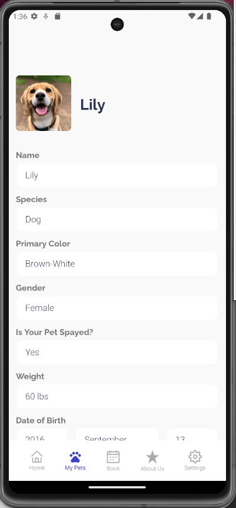

# Description
`"Happy Tails"` is a dedicated veterinary application designed for the local single vet office. This user-friendly app seamlessly integrates modern technology with personalized pet care, offering a range of features to enhance the overall veterinary experience.

**Centralized Medical Records:** Keep all your pet's medical information in one secure place. Happy Tails allows you to effortlessly store vital medical data, including vaccination records and medications. This feature ensures that your pet's health history is easily retrievable whenever needed.

**Online Appointment Booking:** With Happy Tails, booking appointments is a breeze. The intuitive interface allows pet owners to schedule veterinary appointments conveniently from their smartphones. Choose the date and time that suits you best, and receive near-instant confirmation, streamlining the process for both pet owners and the veterinary office.

**Vaccination Reminders:** Automatically receive vaccination reminders from the clinic to ensure your pet stays on track with their prescribed treatments. Never miss a dose and keep your furry friend in optimal health with timely notifications.

**Emergency Information:** Store emergency contact details, veterinary clinic information, and relevant medical information in one easily accessible place.

## Github Repository Links
- Frontend Repo: https://github.com/Jagerziel/Happy_Tails_Frontend
- Backend Repo: https://github.com/Jagerziel/Happy_Tails_Backend

## Application Screenshots
**Home Screen**

*The landing screen when a user first logs into the application.  This screen provides the user with an overview of their pets' appointments and current vaccination status.*  


**My Pets Screen**

*On this screen a user can add a new pet as well as view the full profile of any of their pets.*  




**Book Appointment Screen**

*This screen allows a user to book an appointment with their vet.*  


**About Us Screen**

*This screen allows a user to quickly see all of their vet's information such as address, phone number, and email*  


**Settings Screen**

*In settings, a user can update various information within the application such as profile, PIN, and emergency contact.*  


## The Approach to Building Happy Tails

### Design

Working closely with a UX/UI designer, we meticulously constructed Happy Tails to be responsive on both IOS and Android, utilizing react-native expo.  For a full walkthrough of the design process, please visit: `LINK COMING SOON`

### Colloaboration

Weekly meetings, KPI's, and close communication allowed for staging clear and obtainable goals, prioritization of features, and workload management.  

## Technical Notes

The Happy Tails application was constructed using react-native expo.  The following were key in our approach:

### Reusable Components

Components were structured to be reusable where possible.  This was done in various ways.  On a base level, an input may only require a name - such as a static input field.  Varying versions allow for the intake of a function to be handled as well.  Here is an example:

```
function StaticInputFieldArrow( { name, arrowNext } ) {
    return (
        <View style={styles.container}
        >
            <Text style={[styleMaster.defaultFont, styles.textField]}>{name}</Text>
            <TouchableOpacity onPress={arrowNext}>
                <NextArrow /> 
            </TouchableOpacity>
        </View>
    );
}
```

Other versions include the reuse of a button named `LoginScreenButton` which takes the text to be shown on the button, the function to be executed when the button is pressed, and an optional disable feature.  Here's a brief explaination of each use case:

 - text: the text shown on the button
 - handlePress: the function to be executed upon clicking the button.  This could be anything and is set from the parent component.  An example could be to update the database and navigate from the current screen to a new one.
  - disabled: this takes a boolean any by default is false (i.e. the button is enabled if no parameter is passed).  The feature was added to allow the button to be disabled if, for instance, a user did not complete all required fields.

Here is an example of the component:

```
function LoginScreenButton( { text, handlePress, disabled } ) {
    return (
        <TouchableOpacity 
            style={[styles.button, { backgroundColor: disabled ? colors.primaryFade : colors.primary }]} 
            onPress={handlePress}
            disabled={disabled}
        >
            <Text style={[styleMaster.defaultFont, styles.buttonText]}>{text}</Text>
        </TouchableOpacity>
    );
}
```

### API Calls and State Management

The backend utilizes `MongoDB` and the state management primarily used is `React Redux` along with `React-Toolkit`.  Both work in conjunction for a smooth experience.  Here's how it works:

1) When a user logs in or creates an account, two things occur.  The first is an API call is made to the database to collect all the relevent information from **that specific user**.  That information is then saved via **Redux** so it is accessible throughout the application.
2) Whenever data is needed, the API is not called - the data is instead pulled from **Redux**. 
3) If any changes (creation, updates, or deletes) are required, the action is **first done through the API**, then **Redux is updated**.  The goal of this is to reduce the number of api calls required, and only under two occasions is the full data for a user affected: a) when the user first logs in or is created as mentioned above, and b) when a user deletes their account.

### Customized Library Components

To ensure seemless integration of features across IOS and Android platforms, library components were used to enhance Happy Tails.  These were customized in our application to allow easy interaction with the libraries.  Here are a few:

 - DateTime Picker: https://www.npmjs.com/package/react-native-modal-datetime-picker
 - Expo Switch Button: https://reactnative.dev/docs/switch

### Customized Scaling

In order to align with the Figma design, custom scaling was used to keep the experience as similar as possible across platforms.  A great article was used as guidance for this: https://medium.com/soluto-engineering/size-matters-5aeeb462900a

### Folder Structure

For ease of aligning structure between developers, the following was used as a high level guide for structuring our folders: https://techjugaar.com/best-react-native-folder-structure-expo-2023/

## Dependencies

 - @expo/webpack-config
 - @react-native-community/datetimepicker
 - @react-navigation/native
 - @react-navigation/native-stack
 - @reduxjs/toolkit
 - axios
 - expo
 - expo-app-loading
 - expo-font
 - expo-splash-screen
 - expo-status-bar
 - react
 - react-dom
 - react-native
 - react-native-dotenv
 - react-native-link
 - react-native-modal-datetime-picker
 - react-native-safe-area-context
 - react-native-screens
 - react-native-svg
 - react-native-svg-transformer
 - react-native-web
 - react-redux
 - redux
 - webpack-dev-server

# Development Team

### Ryan Ehrlich - Software Developer

**LinkedIn:** https://www.linkedin.com/in/ryanehrlich/

**Portfolio:** https://ryanehrlich.me/

**GitHub:** https://github.com/Jagerziel

### Anna Druzhinina

**LinkedIn**: https://www.linkedin.com/in/anna-druzhinina/

**Portfolio:** https://anna.rcbd.org/

**GitHub**: https://github.com/annadruzhinina

# Design Team

### Ksenia Hardy - UX/UI Designer

**LinkedIn:** https://www.linkedin.com/in/kseniahardy

**Portfolio:** https://www.kseniahardy.com/


